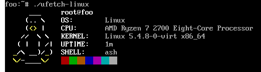

# ufetch

Tiny system info for Unix-like operating systems, compatible with POSIX sh.
Written for my router running FreshTomato.

# Credits
Combines parts of [ufetch](https://gitlab.com/jschx/ufetch), [pfetch](https://github.com/dylanaraps/pfetch) and [neofetch](https://github.com/dylanaraps/neofetch).

